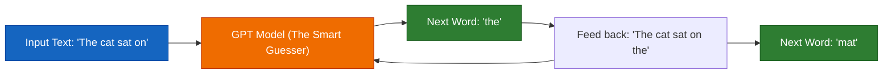
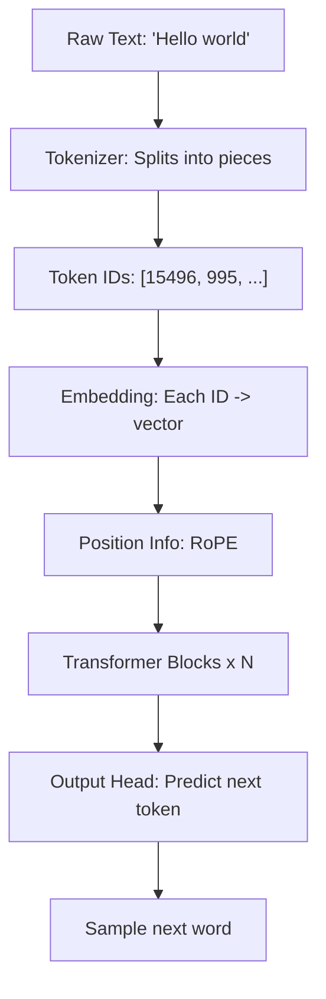

# Chapter 0 — What Even Is a GPT?

> *"If you can explain it to a 5-year-old, you truly understand it."*

---

## The 5-Year-Old Analogy

Imagine you have a friend who has read **every book in the library**. You start a sentence:

> *"The cat sat on the..."*

Your friend, having read so many books, **guesses** the next word: **"mat"**.

That's all a GPT is: **a machine that reads tons of text and learns to guess the next word.**

| Concept | Analogy |
|---|---|
| **GPT** | A very smart "next-word guesser" |
| **Training** | Reading millions of books to learn patterns |
| **Text Generation** | Playing "finish my sentence" forever |
| **Parameters** | The "memory" of all patterns it learned |
| **Attention** | Knowing which words matter most |

## The Big Picture: Pipeline Overview

## Which Models Is This Based On?

**Short answer: This is a modern decoder-only Transformer (LLaMA-style), incorporating the best publicly-documented techniques from 2023-2025.**

## What You Will Build

By the end of this guide, you will have built from scratch:

| Component | What It Does | Chapter |
|---|---|---|
| **Tokenizer** | Converts text ↔ numbers (BPE, same algorithm as GPT-4) | [2](02_tokenization.md) |
| **Embeddings** | Gives each token a 768-dimensional "meaning vector" | [3](03_embeddings.md) |
| **RoPE** | Teaches the model about word order using rotation | [4](04_positional_encoding.md) |
| **Attention** | Lets words "look at" and "talk to" each other | [5](05_attention.md) |
| **Transformer Block** | Complete thinking unit: attention + feed-forward + residuals | [6](06_transformer_block.md) |
| **GPT Model** | Full 124M parameter language model | [7](07_gpt_model.md) |
| **Training Pipeline** | Data loading, AdamW, cosine schedule, mixed precision | [8](08_training.md) |
| **Inference Engine** | Text generation with temperature, top-k, top-p, KV cache | [9](09_inference.md) |
| **Complete Script** | One file that trains and generates — runnable start to finish | [10](10_full_script.md) |

**Who is this for?** Anyone who knows basic Python. No ML/AI experience needed. Every concept is explained with analogies first, then math, then annotated code.

**What you'll need:** A computer with Python 3.10+. A GPU is nice but not required — we provide a tiny config that runs on CPU.

## Which Models Is This Based On? (Technical)

| Technique | Source Model | Publicly Confirmed? |
|---|---|---|
| Decoder-only Transformer | GPT-2 (2019), GPT-3 (2020) | Yes |
| Pre-Norm residual | GPT-3 (2020) | Yes |
| BPE tokenizer | GPT-2/3/4 | Yes |
| AdamW optimizer | GPT-3 (2020) | Yes |
| Cosine LR + warmup | GPT-3 (2020) | Yes |
| Weight tying | GPT-2/3 | Yes |
| **RoPE** (position encoding) | **LLaMA, Mistral, Qwen** | Yes — NOT GPT-3/4 |
| **RMSNorm** (normalization) | **LLaMA, Mistral, Gemma** | Yes — NOT GPT-3/4 |
| **SwiGLU** (activation) | **PaLM, LLaMA, Gemini** | Yes — NOT GPT-3 |
| Mixed precision (bfloat16) | All modern models | Yes |

**What about GPT-4 and Claude?** Their architectures are **proprietary and undisclosed**. We know GPT-4 is a Transformer, but not which positional encoding, normalization, or activation it uses. Claude's architecture is entirely secret.

**What this guide teaches:** The most advanced **publicly documented** architecture — essentially what **LLaMA 3, Mistral, Qwen 2.5, and Gemma** use. This is the architecture behind the best open-source models and represents the state of the art that we actually have confirmed documentation for.

**What makes a model "world-class"?**

1. **Scale** — billions of parameters trained on trillions of tokens
2. **Architecture** — the modern Transformer (our focus)
3. **Data Quality** — clean, diverse, well-filtered text
4. **Training Tricks** — mixed precision, gradient clipping, LR schedules

> We'll build a tiny version using the **same publicly-documented techniques** as the best open-source models.

---

**Next:** [Chapter 1 — Setup & Tooling](01_setup.md)
