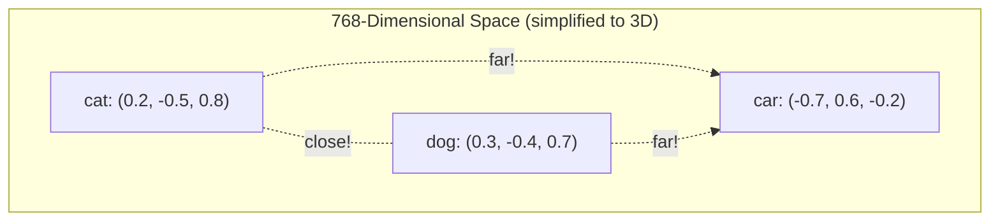

# Chapter 3 — Embeddings: Giving Numbers Meaning

## The 5-Year-Old Analogy

Imagine each word lives in a **giant apartment building** with 768 floors (dimensions).

- **"Cat"** lives on the 3rd floor east, 15th floor north, etc.
- **"Dog"** lives nearby — similar floors, because they're both animals.
- **"Car"** lives far away — completely different floors.

Every word has a **coordinate** in this building. Words with similar meanings have similar coordinates. That's what an embedding is: **a coordinate for a word in meaning-space.**



## The Famous "King - Man + Woman = Queen" Analogy

This is the most famous example of what embeddings can capture:

```python
# In a well-trained embedding space:
# embedding("king") - embedding("man") + embedding("woman")
# ≈ embedding("queen")
```

**Why does this work?** "King" has two components in meaning-space:
- Royalty (shared with "queen", "prince", "throne")
- Masculinity (shared with "man", "he", "boy")

Subtracting "man" removes the masculinity component. Adding "woman" adds femininity. Result: a vector that means "royalty + femininity" = "queen."

This isn't programmed — it **emerges naturally** from the math of training. The model learns that changing gender while keeping meaning produces a consistent "direction" in embedding space.

## How Embeddings Are LEARNED

This is the most important question: "If embeddings start random, how do they become meaningful?"

### Step 1: Random Initialization

When we create the model, every embedding row is random noise:
```
Token 9246 ("cat"): [0.002, -0.013, 0.007, ..., -0.009]   (768 random numbers)
Token 6734 ("sat"): [0.015, 0.001, -0.011, ..., 0.004]   (768 random numbers)
```

At this point, "cat" and "dog" are **no closer** to each other than "cat" and "the." The model knows nothing.

### Step 2: Training Signal

During training, the model sees: `"The cat sat on the mat"` and tries to predict the next word.

When it's wrong about "mat" (predicting "dog" instead), the **loss** is high. Backpropagation sends a signal:
- "The embedding for 'cat' should be updated so it's more predictive of 'mat'"
- "The embedding for 'mat' should be closer to things that follow 'the'"

### Step 3: Gradient Descent Updates Embeddings

```python
# Simplified — what happens to one embedding during one training step:

# Current embedding for token "cat":
cat_embedding = [0.002, -0.013, 0.007, ..., -0.009]

# After seeing "The ___ sat on the mat" (filling in "cat"):
# The gradient says: "move dimension 5 up by 0.0003, dimension 42 down by 0.0001..."
cat_embedding = [0.002, -0.012, 0.008, ..., -0.010]  # Tiny update

# After MILLIONS of examples, patterns emerge:
# - "cat" moves close to "dog", "pet", "feline"
# - "cat" stays far from "car", "democracy", "photosynthesis"
```

### Step 4: After Training — Emergent Structure

After training on billions of tokens, the 768-dimensional space develops meaningful structure:

```
Direction 1 (0-63):   Animacy — alive vs non-alive
Direction 2 (64-127): Size — big vs small  
Direction 3 (128-191): Sentiment — positive vs negative
Direction 4 (192-255): Formality — formal vs casual
...
```

These "directions" aren't assigned by humans. They emerge from the geometry of language. The model discovers that it's useful to cluster related concepts together because they appear in similar contexts.

## A note on scaling

GPT-2 and GPT-3 multiply embeddings by `sqrt(d_model)`. This is needed
when you ADD positional encodings to embeddings because the two signals
must have comparable magnitude. Position values from sin/cos are between
-1 and 1 while freshly initialized embeddings are much smaller.

We use RoPE instead. RoPE does not add position information. It rotates
the query and key vectors. Rotation preserves vector magnitude so there
is no problem of one signal drowning out the other. Following LLaMA's
convention we do not apply any scaling to the embeddings in our code.
The embedding layer just looks up the vector and returns it.

```python
embeddings = self.embed(x)           # Values are ~N(0, 0.02) from init
# No scaling needed with RoPE — LLaMA and Mistral do not scale embeddings
```

## What Determines Embedding Quality?

| Factor | Good Embeddings | Bad Embeddings |
|---|---|---|
| Training data volume | 100B+ tokens | 1M tokens |
| Embedding dimension | 768+ (GPT-2) to 12288 (GPT-3) | 64 or less |
| Vocabulary size | 50K (balanced) | 5K (too small) or 500K (too sparse) |
| Training duration | Converged loss | Early stopping |
| Data diversity | Books, web, code, conversation | Single domain |

## Embedding Code — Annotated

```python
import torch
import torch.nn as nn
import math


class Embedding(nn.Module):
    """
    WHAT: Converts token IDs into dense vectors (embeddings).
    WHY: A neural network can't do meaningful math on integer IDs
         like [9246, 6734]. It needs continuous numbers in vectors.

         Think of it as a giant lookup table:
         Row 9246 -> vector of 768 floats (the "meaning" of "cat")
         Row 6734 -> vector of 768 floats (the "meaning" of "sat")

         This table is LEARNED. Initially random, backpropagation
         gradually moves related tokens closer together in the
         768-dimensional space.
    """

    def __init__(self, vocab_size: int, d_model: int):
        """
        WHAT: Create the embedding table (a learnable matrix).

        Args:
            vocab_size: How many unique tokens exist (50,257 for GPT-2)
            d_model:    Size of each embedding vector.

        Examples by model scale:
            GPT-2 small:  vocab=50257, d_model=768   → table is 50257 × 768
            GPT-2 medium: vocab=50257, d_model=1024  → table is 50257 × 1024
            GPT-3 small:  vocab=50257, d_model=4096  → table is 50257 × 4096
            GPT-3 large:  vocab=50257, d_model=12288 → table is 50257 × 12288

        WHY: The embedding dimension determines how much "space"
             each word has to express its meaning. Bigger d_model =
             more nuanced meanings can be captured, at the cost of
             more parameters and slower training.
        """
        super().__init__()

        # WHAT: The actual embedding weights — a [vocab_size, d_model] matrix
        # WHY: nn.Embedding is an optimized lookup table. When you pass
        #      a tensor of token IDs, it returns the corresponding rows.
        #      It's backed by a standard weight matrix, so gradients
        #      flow through it just like any nn.Linear layer.
        #
        #      Internally, nn.Embedding is essentially:
        #      def forward(self, x):
        #          return self.weight[x]  # index into the weight matrix
        self.embed = nn.Embedding(vocab_size, d_model)

    def forward(self, x: torch.Tensor) -> torch.Tensor:
        """
        WHAT: Look up embeddings for each token ID in the input.

        Input shape:  [batch_size, seq_len]    — each cell is a token ID
        Output shape: [batch_size, seq_len, d_model] — each cell is a vector

        Example walkthrough:
            Input:  [[464, 3797]]              # ["The", "cat"]
            Step 1: Look up row 464 → [768 floats] for "The"
                    Look up row 3797 → [768 floats] for "cat"
            Step 2: Scale by sqrt(768) ≈ 27.7
            Output: [[[v0..v767], [v0..v767]]] # 2 vectors of 768 numbers

        WHY each dimension:
            batch_size = how many sequences we process at once (parallelism)
            seq_len    = how many tokens per sequence (context window)
            d_model    = how rich each token's representation is (expressiveness)
        """
        # WHAT: Index into the embedding matrix
        # WHY: For each token ID, return its row. This is an O(1)
        #      lookup operation — very fast, even for 50K+ vocabulary.
        embeddings = self.embed(x)  # [batch, seq_len, d_model]

        # WHAT: Return embeddings unchanged
        # WHY: We use RoPE for position encoding. RoPE rotates rather
        #      than adds, so no scaling is needed. LLaMA and Mistral
        #      follow this same convention.
        return embeddings
```

## Quick Mind-Test

Before moving on, check your understanding:

1. **Q:** If "cat" is token 9246, what is the embedding of "cat"?
   **A:** Whatever row 9246 of the embedding matrix contains. Initially random, after training it's a 768-dimensional vector that captures the "meaning" of "cat."

2. **Q:** Why can't we use the raw token IDs (9246, 6734, etc.) directly?
   **A:** Because 9246 and 6734 are just arbitrary numbers. The model would think 9246 > 6734 (false relationship). Embeddings let the model learn that "cat" (9246) is similar to "dog" (not a nearby ID, but a nearby vector).

3. **Q:** Do embeddings capture meaning for punctuation too?
   **A:** Yes! "." (period), "," (comma), "?" all have embeddings. The model learns that "." is followed by capitalized words, "?" is followed by answers, etc.

---

**Previous:** [Chapter 2 — Tokenization](02_tokenization.md)
**Next:** [Chapter 4 — Positional Encoding](04_positional_encoding.md)
