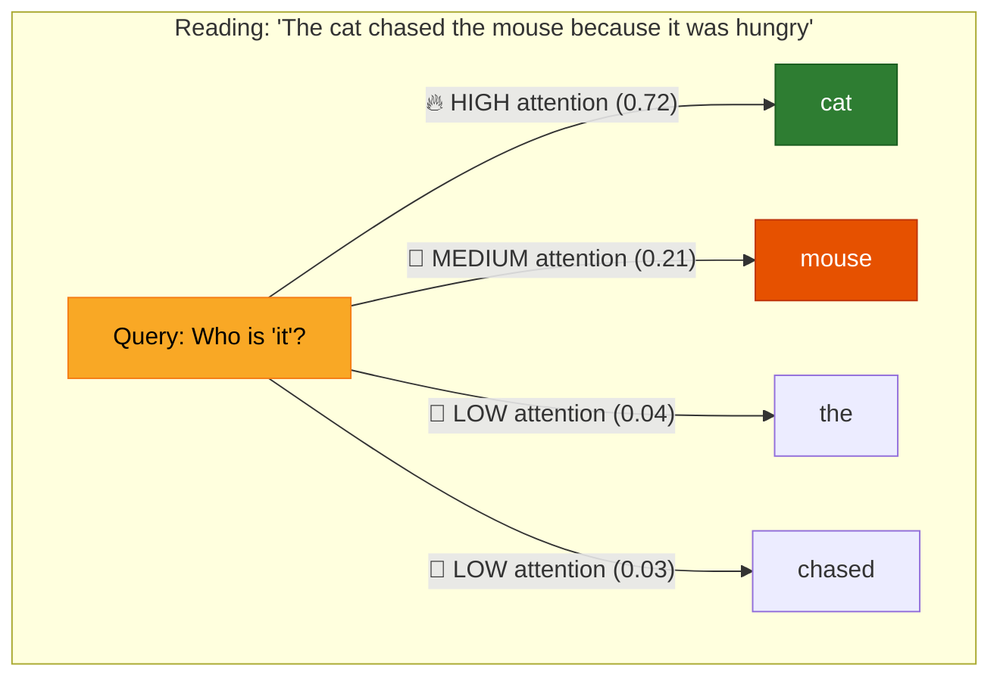
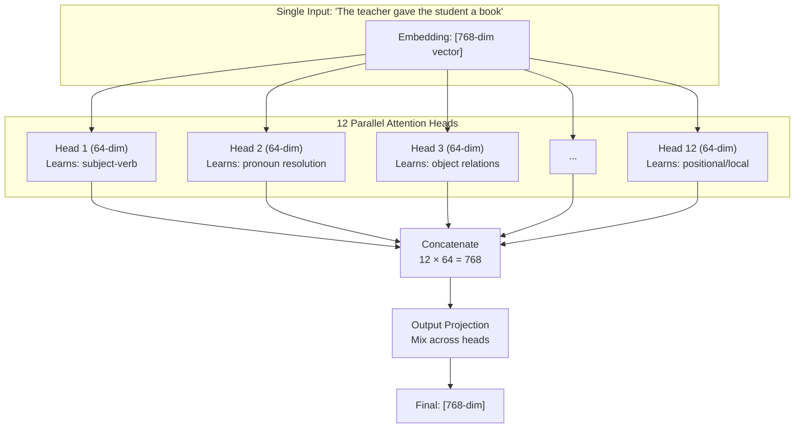
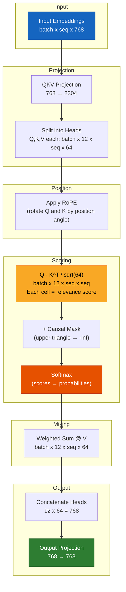

# Chapter 5 — Attention: The Secret Sauce

> *Attention is not just a part of the Transformer. Attention IS the Transformer.*

## The 5-Year-Old Analogy

You walk into a crowded party. You want to understand what's happening. You don't listen to **everyone equally**. You pay **more attention** to:

- The person you're talking to (high relevance)
- The person shouting loudly (high importance)
- The conversation about your favorite topic (high match with your interests)

**Attention is the model's ability to look at ALL words and decide: "How much should I care about this word RIGHT NOW?"**



---

## Part 1: Self-Attention — The Core Idea

### The Problem It Solves

Consider this sentence: **"The cat sat on the mat because it was warm."**

What does **"it"** refer to? The cat? The mat? A human instantly knows "it" = "mat" (because mats are warm, cats are warm-blooded). But how does a computer figure this out?

**Before attention (RNNs, LSTMs):** Words were processed one at a time, left to right. By the time the model reached "it", the word "mat" was far in the past — its information had faded.

**With attention:** The model can look back at ALL previous words simultaneously and decide: "mat" matches "it" best because "warm" is often associated with surfaces/objects.

### What Self-Attention Computes

For every word in a sequence, self-attention creates a **new representation** of that word that is a **weighted mixture of all words in the sequence**:

```
New("it") = 0.72 × cat + 0.21 × mouse + 0.04 × the + 0.03 × chased
```

The weights (0.72, 0.21, 0.04, 0.03) are the **attention scores** — they tell us how much each word matters.

---

## Part 2: The Math — From Words to Attention Scores

### Step-by-Step Worked Example

Let's trace through attention with **real (simplified) numbers**. We'll use a tiny model with `d_model=4` and `num_heads=2` for clarity.

**Input:** The sentence `"I love dogs"` after tokenization and embedding:
```
Token 0 ("I"):    [0.5,  0.2, -0.3,  0.8]
Token 1 ("love"): [0.1, -0.5,  0.7, -0.2]
Token 2 ("dogs"): [0.9,  0.3, -0.1, -0.5]
```

### Step 1: Create Q, K, V from the input

Each token's embedding is multiplied by three weight matrices to produce Query, Key, and Value vectors:

```
Q = x × W_q    (Query: "What am I looking for?")
K = x × W_k    (Key:   "What do I have to offer?")
V = x × W_v    (Value: "My actual content/information")
```

These weight matrices `W_q, W_k, W_v` are **learned during training**. Initially random, they gradually learn to project tokens into useful Q/K/V spaces.

For our tiny example, let's say after projection (with `head_dim=2`):

```
Token │ Query (Q)    │ Key (K)      │ Value (V)
──────┼───────────────┼──────────────┼──────────────
 0:"I"   │ [ 0.8,  0.1] │ [ 0.6, -0.3] │ [ 0.4,  0.9]
 1:"love"│ [-0.2,  0.7] │ [ 0.1,  0.5] │ [-0.3,  0.2]
 2:"dogs"│ [ 0.5, -0.4] │ [-0.4,  0.8] │ [ 0.7, -0.1]
```

### Step 2: Compute Attention Scores

The attention score between token `i` (query) and token `j` (key) is the **dot product**:

```
score(i→j) = Q_i · K_j
```

This measures how well token `i`'s query matches token `j`'s key. High dot product = high relevance.

**Computing scores for token 2 ("dogs") looking at all tokens:**

```
score("dogs"→"I")    = Q₂ · K₀ = [0.5, -0.4] · [ 0.6, -0.3] = 0.30 + 0.12 = 0.42
score("dogs"→"love") = Q₂ · K₁ = [0.5, -0.4] · [ 0.1,  0.5] = 0.05 - 0.20 = -0.15
score("dogs"→"dogs") = Q₂ · K₂ = [0.5, -0.4] · [-0.4,  0.8] = -0.20 - 0.32 = -0.52
```

### Step 3: Scale the scores

Divide by `sqrt(head_dim)` = `sqrt(2)` ≈ 1.414:

```
Why? If d_k is large, dot products become large numbers.
Large numbers → softmax becomes very "peaky" (one value near 1.0,
rest near 0.0) → gradients vanish → model stops learning.

Scaling keeps the variance at 1.0 regardless of d_k.
```

```
Scaled scores: [0.42/1.414, -0.15/1.414, -0.52/1.414] = [0.297, -0.106, -0.368]
```

### Step 4: Apply Causal Mask (training only)

During training, token at position `i` cannot see tokens at positions `> i`. This means:

```
For token 0 ("I"):    can only see position 0
For token 1 ("love"): can only see positions 0, 1
For token 2 ("dogs"): can only see positions 0, 1, 2
```

Future positions are set to `-infinity` (so their softmax becomes 0).

### Step 5: Softmax → Attention Weights

Convert scores to probabilities that sum to 1:

```
softmax([0.297, -0.106, -0.368]) = [0.53, 0.35, 0.12]
```

**Interpretation:** When processing "dogs", the model pays:
- 53% attention to "I"
- 35% attention to "love"
- 12% attention to "dogs" (itself)

### Step 6: Weighted Sum of Values

Multiply each token's value vector by its attention weight and sum:

```
New("dogs") = 0.53 × V("I") + 0.35 × V("love") + 0.12 × V("dogs")

            = 0.53 × [ 0.4,  0.9] + 0.35 × [-0.3,  0.2] + 0.12 × [ 0.7, -0.1]
            = [0.212, 0.477]      + [-0.105, 0.070]      + [0.084, -0.012]
            = [0.191, 0.535]
```

**This new vector [0.191, 0.535] is the "context-aware" representation of "dogs"** — it now contains information from "I" and "love", weighted by relevance.

### The Full Attention Matrix

For our 3-token sequence, the complete attention weight matrix:

```
         │ "I"    "love"  "dogs"  ← (keys: "what I offer")
─────────┼──────────────────────
"I"      │ 1.00   0.00    0.00    ← "I" can only see itself (causal)
"love"   │ 0.45   0.55    0.00    ← "love" sees "I" and itself
"dogs"   │ 0.53   0.35    0.12    ← "dogs" sees all three
    ↑
(queries: "what I'm looking for")
```

This is the **causal attention pattern** — a lower-triangular matrix where each row sums to 1.0. Every token builds its representation from itself and all tokens before it.

---

## Part 3: Multi-Head Attention — Why Multiple Heads?

### The Limitation of a Single Head

With one attention head, the model averages ALL relationships into one representation. But language has many simultaneous relationships:

```
"The teacher gave the student a book because she was proud of him."

Q: Who is "she"?  → teacher (gender agreement)
Q: Who is "him"?   → student (gender agreement)
Q: Who gave what?   → teacher → student → book (syntactic roles)
```

A single head must compress all three answers into one vector — messy, lossy, confused.

### Multi-Head: Divide and Conquer

Instead, we run attention **multiple times in parallel**, each with its own `W_q, W_k, W_v`:

```
Head 1 learns: subject-verb relationships → "teacher" ↔ "gave"
Head 2 learns: pronoun resolution        → "she" ↔ "teacher"
Head 3 learns: object relationships      → "student" ↔ "book"
Head 4 learns: adjective-noun patterns   → "proud" ↔ "teacher"
...
Head 12: positional patterns, punctuation, etc.
```

Each head has dimension `d_model / num_heads`. For GPT-2 small: `768 / 12 = 64` dimensions per head.



### What Heads Actually Learn (from research)

Analyzing trained GPT-2 models reveals head specializations:

- **Early layers (1-3):** Local syntax — adjacent words, punctuation, basic grammar
- **Middle layers (4-8):** Semantic relationships — subject-verb, object relations, entity tracking
- **Late layers (9-12):** High-level patterns — topic coherence, negation scope, anaphora resolution

Some heads become highly specialized:
- "Duplicate token heads": Copy the previous token (useful for repetition)
- "Inhibition heads": Actively suppress attention to certain tokens
- "Position heads": Attend purely by distance (word N positions away)

---

## Part 4: The Scaling Factor — A Critical Detail

### Why `1/sqrt(d_k)`?

The attention formula is:

```
Attention(Q, K, V) = softmax(QK^T / √d_k) × V
```

But why divide by `√d_k`? Let's trace the math:

**Without scaling:** Each element of `QK^T` is a dot product of two vectors of length `d_k`. If each element of Q and K has mean 0 and variance 1, then:

```
Var(dot product) = d_k
```

So with `d_k = 64`, the dot products have variance 64. Standard deviation = 8. This means typical dot products range from about -24 to +24.

**Problem:** When numbers are this large, `softmax` becomes extremely peaked — one value approaches 1.0, and all others approach 0.0. The gradient of softmax is near zero everywhere, so the model stops learning.

**With scaling:** After dividing by `√64 = 8`, the variance becomes 1.0. Dot products range from about -3 to +3. Softmax produces a smoother distribution, and gradients flow properly.

```
Without scaling:  softmax([24, 8, -16]) = [0.99999988, 0.00000011, 0.00000000]  ← useless!
With scaling:     softmax([3, 1, -2])   = [0.88, 0.12, 0.01]                    ← useful!
```

---

## Part 5: Causal Masking — Don't Peek at the Future

### The Problem

During training, we show the model: `"The cat sat on the mat"`

The model's job at position 3 (`"on"`) is to predict `"the"`. But if position 3 can attend to position 5 (`"mat"`), the model can **cheat** — it sees the answer before predicting!

### The Solution: Lower Triangular Mask

```
         │ pos0  pos1  pos2  pos3  pos4
─────────┼─────────────────────────────
pos0     │  ✓     ✗     ✗     ✗     ✗    "The" can only see itself
pos1     │  ✓     ✓     ✗     ✗     ✗    "cat" sees "The" and itself
pos2     │  ✓     ✓     ✓     ✗     ✗    "sat" sees first three
pos3     │  ✓     ✓     ✓     ✓     ✗    "on"  sees first four
pos4     │  ✓     ✓     ✓     ✓     ✓    "the" sees all five
```

Implementation: set upper triangle to `-infinity` → after softmax, those positions become 0.0.

```python
# Before mask:
attn_scores = [[0.3,  0.5,  0.2, -0.1, -0.4],  # row 0
               [0.1,  0.4, -0.3,  0.6, -0.2],  # row 1
               ...]

# Apply mask (upper triangle = -inf):
attn_scores = [[0.3, -inf, -inf, -inf, -inf],  # row 0: only sees pos 0
               [0.1,  0.4, -inf, -inf, -inf],  # row 1: sees 0,1
               [0.5, -0.2,  0.3, -inf, -inf],  # row 2: sees 0,1,2
               ...]

# After softmax:
attn_weights = [[1.0,  0.0,  0.0,  0.0,  0.0],  # row 0: all weight on itself
                [0.43, 0.57, 0.0,  0.0,  0.0],  # row 1: split between 0,1
                [0.42, 0.21, 0.37, 0.0,  0.0],  # row 2: weighted mixture
                ...]
```

### At Inference Time

During text generation, causal masking is **implicitly maintained** — we generate tokens one at a time, so future tokens simply don't exist yet. The current token can only attend to previously generated tokens.

---

## Part 6: Computational Complexity — The O(n²) Problem

### Why Long Context Is Hard

Attention computes `Q @ K^T`, producing a `[seq_len × seq_len]` matrix:

| Sequence Length | Attention Matrix Size | Memory (float32) |
|---|---|---|
| 1,024 (GPT-2) | 1,024 × 1,024 | 4 MB |
| 2,048 (GPT-3) | 2,048 × 2,048 | 16 MB |
| 8,192 (LLaMA 2) | 8,192 × 8,192 | 256 MB |
| 32,768 (GPT-4 Turbo) | 32,768 × 32,768 | 4 GB |
| 128,000 (Claude 3) | 128K × 128K | 64 GB |
| 1,000,000 (Gemini) | 1M × 1M | 4 TB |

This quadratic growth is the **fundamental bottleneck** of Transformer models.

### Solutions

| Method | How It Works | Speedup |
|---|---|---|
| **Flash Attention** | Optimize memory access patterns, fuse kernels | 2-4x |
| **Sparse Attention** | Attend to only √n tokens (local + global) | 10-100x |
| **Sliding Window** | Attend only to last W tokens (Mistral) | Linear O(n) |
| **Ring Attention** | Split sequence across GPUs in a ring | Scales with GPUs |
| **Mamba/SSMs** | Replace attention entirely with state space models | Linear O(n) |

Most modern LLMs use **Flash Attention** (Dao et al., 2022) which doesn't change the math — it just makes the computation and memory access vastly more efficient through kernel fusion and tiling.

---

## Part 7: Full Multi-Head Attention Code

```python
import torch
import torch.nn as nn
import torch.nn.functional as F
import math


class MultiHeadAttention(nn.Module):
    """
    WHAT: Multi-Head Self-Attention with RoPE and causal masking.

    WHY: Transformers would be useless without attention. This is the
         mechanism that lets each token "look at" every other token and
         decide how much each matters for understanding the current context.

         Each attention head:
         1. Projects input into Query, Key, Value spaces
         2. Computes Q·K^T / sqrt(d_k) → how well each query matches each key
         3. Applies causal mask → no peeking at future tokens
         4. Softmax → converts scores to a probability distribution
         5. Weighted sum of Values → builds context-aware representation

         Doing this with multiple heads in parallel lets each head
         specialize in different linguistic patterns.
    """

    def __init__(self, d_model: int, num_heads: int, dropout: float = 0.1):
        """
        Args:
            d_model:   Total embedding dimension (e.g., 768 for GPT-2 small)
            num_heads: Number of parallel attention heads (e.g., 12)
            dropout:   Probability of randomly zeroing attention weights

        WHY: d_model must be divisible by num_heads because each head
             operates on d_model/num_heads dimensions (64 for GPT-2 small).
             This split-then-concat strategy lets heads specialize while
             keeping total parameter count the same as a single large head.
        """
        super().__init__()

        # WHAT: Validate that heads evenly divide the model dimension
        assert d_model % num_heads == 0, (
            f"d_model ({d_model}) must be divisible by num_heads ({num_heads}). "
            f"This ensures each head has equal dimension."
        )

        self.d_model = d_model
        self.num_heads = num_heads
        self.head_dim = d_model // num_heads  # 768/12 = 64 dimensions per head
                                               # WHY: 64 is the "sweet spot" —
                                               # enough to capture meaning,
                                               # small enough for efficient compute

        # ===== QKV Projection =====
        # WHAT: One big linear layer that projects input to Q, K, V simultaneously
        # WHY:  3 separate Linear(768→768) layers = 3 matrix multiplies.
        #       One combined Linear(768→2304) = 1 bigger matrix multiply.
        #       On GPU, 1 big operation is much faster than 3 small ones
        #       due to better parallelism and fewer kernel launches.
        #       Shape: [d_model, 3 * d_model] = [768, 2304]
        self.qkv_proj = nn.Linear(d_model, 3 * d_model, bias=False)

        # ===== Output Projection =====
        # WHAT: Project concatenated head outputs back to d_model
        # WHY:  After concatenation: [batch, seq, d_model] but each head's
        #       output was computed independently. This linear layer MIXES
        #       information across heads, letting them communicate.
        #       Without it, heads would stay isolated — like 12 experts
        #       who never talk to each other.
        self.out_proj = nn.Linear(d_model, d_model, bias=False)

        # ===== RoPE (Rotary Position Embeddings) =====
        # WHAT: Applies rotation-based position encoding to Q and K only
        # WHY:  RoPE encodes position into the Q and K vectors so that
        #       the dot product Q·K naturally depends on RELATIVE position.
        #       We apply to the head_dim (not d_model) because each head
        #       needs its own position info in its subspace.
        #       V does NOT get RoPE because values carry content, not
        #       position — position is only relevant for deciding
        #       WHICH values to attend to, not the values themselves.
        self.rotary = RotaryPositionalEmbedding(self.head_dim)

        # ===== Dropout =====
        # WHAT: Randomly zero out attention weights during training
        # WHY:  Without dropout, the model can become overconfident —
        #       one token always dominates attention, ignoring other
        #       potentially useful context. Dropout forces the model
        #       to learn redundant attention patterns (backup plans).
        self.attn_dropout = nn.Dropout(dropout)   # Applied to attention weights
        self.resid_dropout = nn.Dropout(dropout)  # Applied to final output

    def forward(self, x: torch.Tensor, mask: torch.Tensor = None) -> torch.Tensor:
        """
        WHAT: Compute multi-head self-attention.

        Input:  x    [batch, seq_len, d_model]  — token embeddings
                mask [batch, 1, seq, seq]       — causal mask (1=visible, 0=masked)

        Output:      [batch, seq_len, d_model]  — context-aware representations

        The forward pass has 8 steps, each critical:
        """
        batch_size, seq_len, _ = x.shape

        # ===== STEP 1: Project input to Q, K, V — all at once =====
        # WHAT: Linearly transform input into query, key, value spaces
        # WHY:  Combined projection is faster on GPU than 3 separate ones.
        #       After this: [batch, seq, 3*d_model] where the last dim
        #       has Q values first, then K values, then V values.
        qkv = self.qkv_proj(x)               # [batch, seq, 3 * d_model]

        # ===== STEP 2: Reshape to expose the head dimension =====
        # WHAT: Split the 3*d_model into separate Q,K,V and separate heads
        # WHY:  We need shape [batch, num_heads, seq, head_dim] for
        #       parallel computation. The reshape + permute does this
        #       in two efficient operations without data copies.
        #
        # Transform: [batch, seq, 3, heads, head_dim]
        # Then permute: [3, batch, heads, seq, head_dim]
        qkv = qkv.reshape(batch_size, seq_len, 3, self.num_heads, self.head_dim)
        qkv = qkv.permute(2, 0, 3, 1, 4)    # [3, batch, heads, seq, head_dim]

        # WHAT: Unpack the three projections
        q = qkv[0]  # Query:  [batch, heads, seq, head_dim] — "what I'm looking for"
        k = qkv[1]  # Key:    [batch, heads, seq, head_dim] — "what I offer to match"
        v = qkv[2]  # Value:  [batch, heads, seq, head_dim] — "my actual content"

        # ===== STEP 3: Apply Rotary Position Embeddings =====
        # WHAT: Rotate Q and K by position-dependent angles
        # WHY:  After rotation, the dot product q_i · k_j depends on
        #       cos(i-j) and sin(i-j) — the RELATIVE distance between
        #       tokens i and j. This is what we want: attention should
        #       care about "how far apart are these tokens?" not
        #       "what are their absolute positions?"
        q = self.rotary(q, seq_len)
        k = self.rotary(k, seq_len)

        # ===== STEP 4: Compute attention scores (Q · K^T) =====
        # WHAT: For each query token, compute dot product with every key token
        # WHY:  Dot product measures cosine similarity (if vectors normalized).
        #       Higher dot product = query "wants" what key "offers".
        #
        #       Shape: [batch, heads, query_seq, key_seq]
        #       attn_scores[b, h, i, j] = how much token i attends to token j
        #
        #       DIVIDE BY sqrt(head_dim): critical for stable training.
        #       Without this, the variance of dot products grows with d_k,
        #       making softmax too "peaky" → gradients vanish → model dies.
        #       See Part 4 above for the mathematical derivation.
        attn_scores = (q @ k.transpose(-2, -1)) / math.sqrt(self.head_dim)

        # ===== STEP 5: Apply causal mask — no peeking at future tokens =====
        # WHAT: Set attention scores to future tokens to -infinity
        # WHY:  During training, the model must predict token[i+1] from
        #       tokens[0..i]. If token[i] can see token[i+1], it's like
        #       seeing the answer before the question — cheating.
        #
        #       -infinity → e^(-inf) = 0.0 after softmax = zero attention
        #
        #       The mask is lower-triangular:
        #       Token 0 → sees [0]        (itself only)
        #       Token 1 → sees [0, 1]     (itself + previous)
        #       Token 2 → sees [0, 1, 2]  (itself + all previous)
        #       Token 3 → sees [0, 1, 2, 3]
        if mask is not None:
            attn_scores = attn_scores.masked_fill(mask == 0, float('-inf'))

        # ===== STEP 6: Softmax — scores become attention weights =====
        # WHAT: Convert raw scores to a probability distribution over keys
        # WHY:  softmax(scores)[j] = e^score[j] / sum(e^score[k] for k in all keys)
        #       This makes all weights:
        #       - Positive (e^x > 0 always)
        #       - Sum to 1.0 (proper probability distribution)
        #       - Differentiable (we can compute gradients through it)
        #
        #       The softmax is applied over the LAST dimension (dim=-1),
        #       which is the "key" dimension — so each query gets a
        #       distribution over all keys it can see.
        attn_weights = F.softmax(attn_scores, dim=-1)
        attn_weights = self.attn_dropout(attn_weights)

        # ===== STEP 7: Weighted sum of values =====
        # WHAT: Mix the value vectors according to attention weights
        # WHY:  This is WHERE attention actually happens. Each query
        #       token gets a NEW vector that is a weighted blend of
        #       all visible value vectors.
        #
        #       High attention to token j → V_j has large influence
        #       Low attention to token j → V_j has small influence
        #
        #       The result is "context-aware" — each token now "knows"
        #       about the other relevant tokens in the sequence.
        #
        #       [batch, heads, seq, head_dim] @ [batch, heads, seq, head_dim]
        #       → [batch, heads, seq, head_dim]
        attn_output = attn_weights @ v

        # ===== STEP 8: Merge heads and project =====
        # WHAT: Combine all head outputs into one d_model vector per token
        # WHY:  Currently: [batch, heads, seq, head_dim]
        #       Need:       [batch, seq, d_model]
        #
        #       Transpose swaps heads and sequence:
        #       [batch, seq, heads, head_dim]
        #       Reshape flattens heads×head_dim:
        #       [batch, seq, d_model]
        #
        #       The final linear projection lets information flow between
        #       heads — each head's discoveries can now influence the
        #       combined representation.
        attn_output = attn_output.transpose(1, 2).contiguous()
        attn_output = attn_output.reshape(batch_size, seq_len, self.d_model)

        output = self.out_proj(attn_output)   # Mix across heads
        output = self.resid_dropout(output)   # Regularization

        return output


def create_causal_mask(seq_len: int, device: torch.device) -> torch.Tensor:
    """
    WHAT: Create a causal (lower triangular) attention mask.
    WHY:  Prevents tokens from attending to future tokens during training.

    Visual for seq_len=6:
        [[✓, ✗, ✗, ✗, ✗, ✗],     Token 0 (first word)
         [✓, ✓, ✗, ✗, ✗, ✗],     Token 1
         [✓, ✓, ✓, ✗, ✗, ✗],     Token 2
         [✓, ✓, ✓, ✓, ✗, ✗],     Token 3
         [✓, ✓, ✓, ✓, ✓, ✗],     Token 4
         [✓, ✓, ✓, ✓, ✓, ✓]]     Token 5 (last word — sees everything)

    ✓ = position is visible (1.0)
    ✗ = position is masked (0.0, becomes -inf in attention)

    Reshaped to [1, 1, seq_len, seq_len] for broadcasting over:
    - batch dimension (all batches use same mask)
    - head dimension (all heads use same mask — heads CAN'T see future)
    """
    mask = torch.tril(torch.ones(seq_len, seq_len, device=device))
    return mask.view(1, 1, seq_len, seq_len)
```

---

## Part 8: What the Model Actually "Sees"

### Attention Heatmap

For the sentence **"The cat sat on the mat because it was comfortable"**, a trained model's attention might look like:

```
         The  cat  sat  on  the  mat  because  it  was  comfortable
The      ████ ░░░░ ░░░░ ░░░░ ░░░░ ░░░░ ░░░░      ░░░░ ░░░░ ░░░░
cat      ████ ████ ░░░░ ░░░░ ░░░░ ░░░░ ░░░░      ░░░░ ░░░░ ░░░░
sat      ░░░░ ████ ████ ░░░░ ░░░░ ░░░░ ░░░░      ░░░░ ░░░░ ░░░░
on       ░░░░ ░░░░ ████ ████ ░░░░ ░░░░ ░░░░      ░░░░ ░░░░ ░░░░
the      ░░░░ ░░░░ ░░░░ ████ ████ ░░░░ ░░░░      ░░░░ ░░░░ ░░░░
mat      ░░░░ ░░░░ ░░░░ ░░░░ ████ ████ ░░░░      ░░░░ ░░░░ ░░░░
because  ░░░░ ░░░░ ░░░░ ░░░░ ░░░░ ████ ████      ░░░░ ░░░░ ░░░░
it       ░░░░ ░░░░ ░░░░ ░░░░ ░░░░ ████ ░░░░      ████ ░░░░ ░░░░
was      ░░░░ ░░░░ ░░░░ ░░░░ ░░░░ ░░░░ ████      ████ ████ ░░░░
comfort. ░░░░ ░░░░ ░░░░ ░░░░ ░░░░ ░░░░ ░░░░      ░░░░ ████ ████
                                         ↑
                        "it" pays strong attention to "mat"
                        (resolving the pronoun reference)
```

Notice two patterns:
1. **Strong diagonal** — every word attends heavily to itself (you always need your own meaning)
2. **Pronoun resolution** — "it" attends to "mat" (the model correctly identified the referent)
3. **Causal structure** — bottom-left triangle only, upper-right is zero

---

## Part 9: Attention Variants (Beyond What We Implement)

| Variant | What It Does | Used By |
|---|---|---|
| **Self-Attention** | Q, K, V all from same input (this code) | All GPT models |
| **Cross-Attention** | Q from decoder, K,V from encoder | Original Transformer, T5 |
| **Grouped Query Attention** | Fewer KV heads than Q heads | LLaMA 2 70B, Mistral |
| **Multi-Query Attention** | Single KV head shared across all Q heads | PaLM, Gemini |
| **Flash Attention** | Fused CUDA kernels for O(n²) speedup | Most production LLMs |
| **Sliding Window** | Attend only to last W tokens | Mistral 7B |
| **Sparse Attention** | Combination of local + strided patterns | Longformer, BigBird |

---

## Attention Flow Diagram



---

## Summary: The Attention Checklist

For each token at position `i`, attention:

- [x] Creates a **Query** ("what am I looking for?")
- [x] Creates a **Key** for every token ("what do I offer?")
- [x] Creates a **Value** for every token ("my actual content")
- [x] Computes **Q_i · K_j** for all visible tokens j ≤ i
- [x] Scales by **1/√d_k** (prevents gradient vanishing)
- [x] Masks future tokens (j > i → -inf)
- [x] Applies **softmax** (converts to probability distribution)
- [x] Computes **weighted sum of Values** (context-aware representation)
- [x] Does this **in parallel for multiple heads** (different linguistic patterns)
- [x] Concatenates and projects heads back to **d_model**
- [x] Adds **dropout** for regularization
- [x] Returns output via **residual connection** (handled by TransformerBlock)

---

**Previous:** [Chapter 4 — Positional Encoding](04_positional_encoding.md)
**Next:** [Chapter 6 — Transformer Block](06_transformer_block.md)
