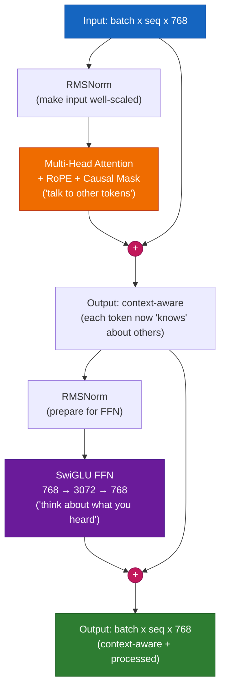

# Chapter 6 — The Transformer Block

## The 5-Year-Old Analogy

A Transformer block is like a **sandwich**:

```
RMSNorm         (prepares the input — makes it "clean" and well-scaled)
  Attention     (the meat — "talk to all other words and gather context")
  + Residual    (skip connection — "keep the original meaning too")
RMSNorm         (prepares again)
  SwiGLU FFN    (the cheese — "think about what you just heard, alone")
  + Residual    (skip connection — "keep what you had, add new insight")
```

Every modern LLM stacks 12-96 of these sandwiches on top of each other.

## The Two Sub-Layers, Explained

### Sub-Layer 1: Attention — "Talk to Everyone"

```
Input:  "The cat sat on the mat"
                            ^
For token "mat": look at "The", "cat", "sat", "on", "the", "mat"
                 Decide: "sat" is most relevant (verb-subject)
                         "the" is second most (article-noun)
                 Mix their meanings into a new "mat" representation
```

### Sub-Layer 2: Feed-Forward — "Think in Private"

```
After attention: each token has a context-aware representation
Now FFN: process EACH token independently with the same weights
         (like studying your notes alone after a group discussion)

Why needed? Attention mixes information BETWEEN tokens.
            FFN processes information WITHIN each token.
            Both are necessary for deep understanding.
```

### Why Can't Attention Do Everything?

A common question: if attention can look at all tokens, why do we need the FFN?

**Answer:** Attention is a LINEAR operation (weighted sum of values). The FFN is NON-LINEAR (has activation functions). Without the FFN, stacking more attention layers would just be more linear combinations — no more powerful than a single attention layer. The FFN's non-linearity (SiLU activation) is what gives the Transformer its universal function approximation power.

```
Attention:  output = Σ(attention_weights × values)    ← linear combination
FFN:        output = W3(SiLU(W1 × x) × (W2 × x))     ← non-linear transform
```

## The Residual Connection — The "Gradient Highway"

### What It Does

```
Without residual:  output = SubLayer(input)
With residual:     output = input + SubLayer(Norm(input))
```

### Why It's Critical: The Vanishing Gradient Problem

In a 12-layer network without residuals, the gradient signal at layer 1 is:

```
gradient_at_layer_1 = gradient_at_layer_12 × (weight_12 × weight_11 × ... × weight_2)
```

If each weight is 0.5 (reasonable for initial training), then:
```
gradient_at_layer_1 = gradient_at_layer_12 × 0.5^11
                    = gradient_at_layer_12 × 0.0005  ← nearly ZERO!
```

This means early layers get almost no learning signal — they stay random, the model never learns.

**With residuals:**

```
With residual:  output = input + SubLayer(input)
```

The gradient now has TWO paths:
1. Through the sublayer: `∂(SubLayer) / ∂(input)` — may be small
2. Through the skip: `∂(input) / ∂(input) = 1.0` — always exactly 1.0!

The overall gradient is `1.0 + small_number` — never vanishing.

**Analogy:** Think of driving from the 12th floor to the 1st floor. Without residuals, you must take 11 staircases (each staircase = weight multiplication). With residuals, there's a fireman's pole (skip connection) that goes straight down — gradient flows instantly, regardless of what the sublayers do.

## Pre-Norm vs Post-Norm: A Critical Design Choice

| Aspect | Post-Norm (Original Paper) | Pre-Norm (Modern) |
|---|---|---|
| Formula | `Norm(x + SubLayer(x))` | `x + SubLayer(Norm(x))` |
| Training stability | Unstable early, needs careful LR | Stable from step 1 |
| Gradient flow | Normalized AFTER addition | Unnormalized residual path |
| Used by | Original Transformer (2017) | GPT-3, LLaMA, PaLM, all modern |
| Deep networks | Fails > 12 layers | Works at 100+ layers |

**Why Pre-Norm works better:** The residual path (`+ x`) stays un-normalized, giving clean gradient flow. Post-Norm normalizes the output, which can squash gradients in deep networks.

## Modern Improvements

| Component | Old Way | Modern Way | Why Better |
|---|---|---|---|
| Normalization | LayerNorm | **RMSNorm** | 15% faster, equally effective, no centering needed |
| Activation | ReLU/GELU | **SwiGLU** | Gated mechanism learns what info to keep/discard |
| Norm Position | Post-Norm | **Pre-Norm** | Stable training at any depth |

## RMSNorm — Deeper Explanation

### LayerNorm vs RMSNorm

```
LayerNorm(x) = ((x - mean(x)) / std(x)) * γ + β
               ^^^^^^^^^^^^^^^^^^^^^^^^^^    ^^^^
               center AND scale             learnable shift and scale

RMSNorm(x)  = (x / rms(x)) * γ
               ^^^^^^^^^^^^    ^^
               only scale      learnable scale only (no shift, no divide by std)
```

RMSNorm drops:
1. **Mean subtraction** (centering) — found unnecessary, adds compute
2. **Bias parameter β** — found unnecessary, the residual connection handles it
3. **Standard deviation** — uses RMS instead (sqrt of mean of squares, simpler to compute)

Result: mathematically simpler, ~15% faster, same performance in practice.

### Why Normalize at All?

Without normalization, the outputs of attention and FFN can grow unbounded. After 12 layers, values might be 100x or 0.01x their original magnitude — causing numerical instability. Normalization keeps every layer's output at a consistent scale.

## RMSNorm Code

```python
import torch
import torch.nn as nn


class RMSNorm(nn.Module):
    """
    WHAT: Root Mean Square Layer Normalization.
    WHY: Normalizes each token's representation so its magnitude is ~1.0.
         Prevents values from growing/shrinking across deep networks.

         Used in: LLaMA 1/2/3, Mistral, Gemma, Qwen
    """

    def __init__(self, d_model: int, eps: float = 1e-6):
        super().__init__()
        # WHAT: Learnable scale per dimension
        # WHY: After forcing RMS=1, the model can learn to amplify
        #      important dimensions and dampen unimportant ones.
        #      Starts at 1.0 (no change initially).
        self.weight = nn.Parameter(torch.ones(d_model))
        self.eps = eps  # WHY: prevents division by zero

    def forward(self, x: torch.Tensor) -> torch.Tensor:
        # WHAT: Compute 1/sqrt(mean(x²))
        # WHY: rsqrt is 1/sqrt — computed as a single CUDA kernel
        #      for speed. The mean is over the last dimension (d_model).
        #      keepdim=True preserves the dimension for broadcasting.
        rms = torch.rsqrt(x.pow(2).mean(-1, keepdim=True) + self.eps)

        # WHAT: Normalize then learnable-scale
        return x * rms * self.weight
```

## SwiGLU Code

```python
import torch
import torch.nn as nn
import torch.nn.functional as F


class SwiGLU(nn.Module):
    """
    WHAT: SwiGLU — gated version of Swish activation.
    WHY: The "gate" (right side of multiplication) learns to
         selectively pass or block information — like a faucet.

         Standard FFN:  output = W2(ReLU(W1(x)))
         SwiGLU FFN:    output = W3(SiLU(W1(x)) * (W2(x)))
                                   ^^^^^^^^      ^^^^^^
                                   values        gate

         The gate multiplies values: if gate ≈ 0, block info.
                                     if gate ≈ 1, pass info.
                                     if gate ≈ 0.5, partial pass.

         This gating mechanism is what makes SwiGLU outperform
         ReLU and GELU — the model learns WHERE to apply non-linearity.

         Paper: "GLU Variants Improve Transformer" (Shazeer, 2020)
         Used in: LLaMA 1/2/3, PaLM, Gemini
    """

    def __init__(self, d_model: int, expansion_factor: int = 4):
        super().__init__()

        # WHAT: Hidden dim is 4x input/output — the "expansion" bottleneck
        # WHY: Expand→process→contract is more expressive than same-size.
        #      784 → 3072 → 784 lets the FFN learn ~4x more complex patterns.
        hidden_dim = expansion_factor * d_model

        self.w1 = nn.Linear(d_model, hidden_dim, bias=False)   # Projects to values
        self.w2 = nn.Linear(d_model, hidden_dim, bias=False)   # Projects to gates
        self.w3 = nn.Linear(hidden_dim, d_model, bias=False)   # Projects back

    def forward(self, x: torch.Tensor) -> torch.Tensor:
        # WHAT: SiLU(w1(x)) are the values, w2(x) are the gates
        # WHY: SiLU (also called Swish) = x * sigmoid(x)
        #      It's smooth (unlike ReLU which has a sharp corner at 0),
        #      which makes gradients flow better during training.
        #      Gate multiplies values element-wise, selectively passing info.
        return self.w3(F.silu(self.w1(x)) * self.w2(x))
```

## Complete Transformer Block Code

```python
import torch
import torch.nn as nn


class TransformerBlock(nn.Module):
    """
    WHAT: One complete Transformer layer (attention + FFN with residuals).
    WHY: Stack N of these to build a deep language model.

         Architecture (Pre-Norm):
         ┌─────────────────────────────────────┐
         │ x = x + Attention(RMSNorm(x), mask) │  ← Mix information BETWEEN tokens
         │ x = x + SwiGLU(RMSNorm(x))          │  ← Process information WITHIN tokens
         └─────────────────────────────────────┘

         Each sublayer: normalize FIRST (pre-norm), then compute,
         then ADD back the original (residual connection).

         Without residuals: deep networks can't train (vanishing gradients)
         Without pre-norm: training is unstable at large depths
         Without FFN: no non-linear processing per token
         Without attention: no information mixing between tokens
    """

    def __init__(self, d_model: int, num_heads: int, dropout: float = 0.1):
        super().__init__()

        # WHAT: First normalization — before attention
        # WHY: Pre-norm: clean, well-scaled input → stable attention computation
        self.norm1 = RMSNorm(d_model)

        # WHAT: Multi-head self-attention with RoPE and causal masking
        # WHY: The core mechanism that lets tokens "talk to" each other
        self.attention = MultiHeadAttention(d_model, num_heads, dropout)

        # WHAT: Second normalization — before FFN
        # WHY: FFN expects normalized input for consistent behavior across layers
        self.norm2 = RMSNorm(d_model)

        # WHAT: SwiGLU feed-forward network
        # WHY: Non-linear processing per token. Without this, stacking more
        #      attention layers would be no more powerful than one layer.
        self.ffn = SwiGLU(d_model)

    def forward(self, x: torch.Tensor, mask: torch.Tensor = None) -> torch.Tensor:
        """
        Forward pass: norm → sublayer → add residual.
        Executed twice: once for attention, once for FFN.
        """

        # ===== SUB-LAYER 1: Self-Attention with residual =====
        # WHAT: x = x + Attention(Norm(x))
        # WHY: The model learns what CHANGES (the delta) to make to x,
        #      not what to replace x with entirely. This is easier to learn.
        #      If attention can't improve things, it can output near-zero.
        x = x + self.attention(self.norm1(x), mask)

        # ===== SUB-LAYER 2: Feed-Forward with residual =====
        # WHAT: x = x + FFN(Norm(x))
        # WHY: Same residual pattern. After mixing information via attention,
        #      each token "thinks" independently via the FFN.
        #      Attention = group discussion. FFN = private reflection.
        x = x + self.ffn(self.norm2(x))

        return x
```

## Architecture Diagram



---

**Previous:** [Chapter 5 — Attention](05_attention.md)
**Next:** [Chapter 7 — The Complete GPT](07_gpt_model.md)
