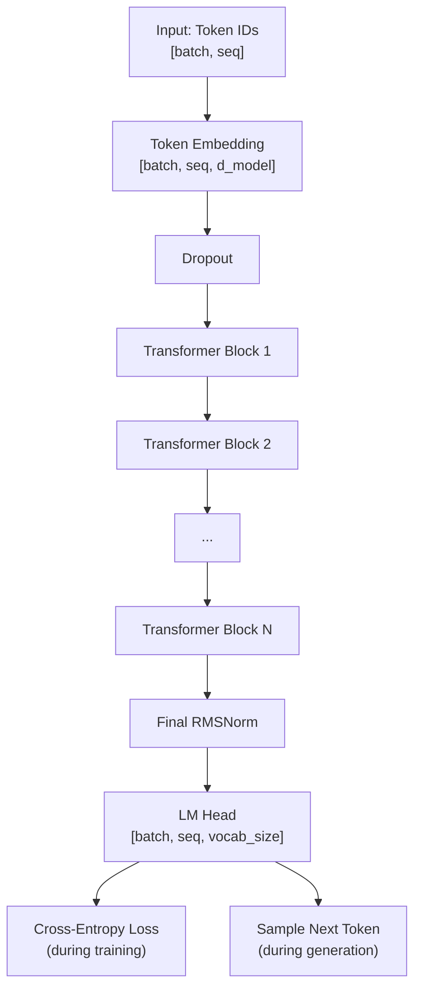

# Chapter 7 — The Complete GPT Model

## What We're Building

After 6 chapters of components, we now assemble them into a **complete language model**. This is essentially the same architecture as LLaMA 3, Mistral, and Qwen 2.5 — scaled down to fit on your GPU.



## The Config — Your Model "Recipe"

```python
from dataclasses import dataclass


@dataclass
class GPTConfig:
    """
    WHAT: All hyperparameters in one place.
    WHY: Changing model size is one line. No hunting through code.
    """
    # ===== Architecture =====
    vocab_size: int = 50257        # WHAT: 50,257 unique tokens in GPT-2 vocabulary
    d_model: int = 768             # WHAT: Each token becomes a 768-dim vector
                                   # WHY: Bigger = more nuanced meanings, more compute
    num_heads: int = 12            # WHAT: 12 attention heads (12 × 64 = 768)
    num_layers: int = 12           # WHAT: 12 transformer blocks stacked
                                   # WHY: Deeper = better reasoning, harder to train
    max_seq_len: int = 1024        # WHAT: Max tokens model can process at once

    # ===== Regularization (prevent overfitting) =====
    dropout: float = 0.1           # WHAT: Randomly disable 10% of neurons during training
    embd_dropout: float = 0.1      # WHAT: Dropout applied right after embedding lookup

    # ===== Training =====
    learning_rate: float = 3e-4    # WHAT: Step size for weight updates
    weight_decay: float = 0.1      # WHAT: Penalize large weights (L2 regularization)
    warmup_steps: int = 2000       # WHAT: Gradually increase LR for first 2000 steps
    max_steps: int = 100000        # WHAT: Total training iterations
    batch_size: int = 8            # WHAT: Sequences processed per GPU step
    grad_accum_steps: int = 4      # WHAT: Accumulate gradient steps (effective batch = 8×4 = 32)
    betas: tuple = (0.9, 0.95)    # WHAT: AdamW momentum coefficients
    eps: float = 1e-8              # WHAT: Small constant preventing division by zero

    def __post_init__(self):
        """Validate configuration consistency."""
        assert self.d_model % self.num_heads == 0, (
            f"d_model ({self.d_model}) must be divisible by "
            f"num_heads ({self.num_heads})"
        )
```

## The Complete GPT Model

```python
import torch
import torch.nn as nn
import torch.nn.functional as F


class GPT(nn.Module):
    """
    WHAT: A complete decoder-only Transformer language model.
    WHY: This single class combines everything we've built:
         embedding → N× transformer blocks → output projection.

         "Decoder-only" means it generates text left-to-right
         (causal/autoregressive), without an encoder that would
         look at the full sequence.

         This is the same architecture family as:
         GPT-2 (12 layers, 768 dims), GPT-3 (96 layers, 12288 dims),
         LLaMA 3 (32-80 layers), Mistral (32 layers)
    """

    def __init__(self, config: GPTConfig):
        super().__init__()
        self.config = config

        # ===== 1. TOKEN EMBEDDING =====
        # WHAT: Lookup table: token ID → dense vector
        # WHY: Converts integers (IDs) into the continuous vectors
        #      that neural networks can work with.
        #      Shape: [50257, 768] — one row per vocabulary token
        self.token_embedding = nn.Embedding(config.vocab_size, config.d_model)

        # WHAT: Dropout applied to embeddings
        # WHY: Early dropout prevents the model from overfitting to
        #      specific embedding values during training
        self.embd_dropout = nn.Dropout(config.embd_dropout)

        # ===== 2. TRANSFORMER BLOCKS =====
        # WHAT: Stack of N identical transformer layers
        # WHY: nn.ModuleList registers each block so PyTorch tracks
        #      their parameters for training. A regular Python list
        #      would NOT be tracked!
        #
        #      Each block: RMSNorm → Attention(+residual) → RMSNorm → FFN(+residual)
        self.layers = nn.ModuleList([
            TransformerBlock(
                d_model=config.d_model,
                num_heads=config.num_heads,
                dropout=config.dropout
            )
            for _ in range(config.num_layers)
        ])

        # ===== 3. FINAL NORMALIZATION =====
        # WHAT: One last RMSNorm before the output head
        # WHY: The output of the last transformer block is raw (unnormalized).
        #      We normalize before projecting to vocabulary so the
        #      LM head gets clean, well-scaled inputs.
        self.final_norm = RMSNorm(config.d_model)

        # ===== 4. LM HEAD (output projection) =====
        # WHAT: Linear projection: d_model → vocab_size
        # WHY: Transforms each token's 768-dim "understanding"
        #      into a 50257-dim vector of scores — one score per
        #      possible next token.
        #
        #      logits[b, t, v] = "score for token v being the next
        #                         word after position t in batch b"
        self.lm_head = nn.Linear(config.d_model, config.vocab_size, bias=False)

        # ===== 5. WEIGHT TYING =====
        # WHAT: Share weight matrix between embedding and LM head
        # WHY: The embedding maps token → vector. The LM head maps
        #      vector → token. These are INVERSE operations!
        #
        #      Sharing weights has three benefits:
        #      1. Parameter efficiency: saves 50257×768 = 38.6M params
        #         (30% of the total for GPT-2 small!)
        #      2. Better regularization: the shared matrix gets
        #         gradient signals from both directions, improving
        #         the quality of token representations
        #      3. Theoretical elegance: input and output tokens
        #         live in the same semantic space
        #
        #      How it works: setting self.lm_head.weight to point to
        #      the SAME tensor as self.token_embedding.weight means
        #      PyTorch uses the same memory for both.
        self.token_embedding.weight = self.lm_head.weight

        # ===== 6. WEIGHT INITIALIZATION =====
        # WHAT: Initialize all weights with Normal(0, 0.02)
        # WHY: Starting from the right distribution is critical.
        #      Too small → gradients vanish, model never learns.
        #      Too large → activations saturate, gradients explode.
        #      0.02 std gives values mostly in [-0.04, 0.04],
        #      which is the sweet spot for Transformers.
        self.apply(self._init_weights)
        print(f"GPT initialized with {self.get_num_params():,} parameters")

    def _init_weights(self, module: nn.Module):
        """Initialize weights using the GPT-2 scheme."""
        if isinstance(module, nn.Linear):
            torch.nn.init.normal_(module.weight, mean=0.0, std=0.02)
            if module.bias is not None:
                torch.nn.init.zeros_(module.bias)
        elif isinstance(module, nn.Embedding):
            torch.nn.init.normal_(module.weight, mean=0.0, std=0.02)

    def get_num_params(self) -> int:
        """Count total trainable parameters (weights + biases)."""
        return sum(p.numel() for p in self.parameters())

    def forward(
        self,
        input_ids: torch.Tensor,
        targets: torch.Tensor = None
    ) -> tuple:
        """
        WHAT: Process a batch of token sequences through the GPT model.

        Args:
            input_ids: [batch_size, seq_len] — token IDs for each sequence
            targets:   [batch_size, seq_len] — same tokens, used for loss
                       (the model predicts input_ids[t+1] from input_ids[t])

        Returns:
            logits: [batch, seq_len, vocab_size] — raw prediction scores
            loss:   scalar — cross-entropy (None if targets not provided)

        The Shift-by-One Trick:
            Input:  [The,  cat,  sat,  on,   the,  mat]
                     ↓     ↓     ↓     ↓     ↓     ↓
            Target: [cat,  sat,  on,   the,  mat,  ?]
            Predict: P(cat|The) P(sat|The,cat) ... P(mat|The,cat,sat,on,the)

            We slice logits[:, :-1] (drop last) and targets[:, 1:] (drop first)
            to align predictions with what comes next.
        """
        batch_size, seq_len = input_ids.shape

        # ===== 1. EMBED TOKENS =====
        # Input:  [batch, seq] token IDs
        # Output: [batch, seq, d_model] continuous vectors
        x = self.token_embedding(input_ids)
        x = self.embd_dropout(x)

        # ===== 2. CREATE CAUSAL MASK =====
        # WHAT: Lower-triangular mask: token i can only see tokens 0..i
        # WHY: Without this, the model would "cheat" by looking at
        #      future tokens when predicting the next one.
        mask = create_causal_mask(seq_len, input_ids.device)

        # ===== 3. TRANSFORMER LAYERS =====
        # WHAT: Pass through all N transformer blocks sequentially
        # WHY: Each layer refines the representations. Early layers
        #      capture syntax. Later layers capture semantics.
        for layer in self.layers:
            x = layer(x, mask)

        # ===== 4. FINAL NORMALIZATION =====
        x = self.final_norm(x)

        # ===== 5. PROJECT TO VOCABULARY =====
        # WHAT: Convert from d_model-dim "understanding" to vocab_size-dim scores
        # WHY: Each position gets a score for every possible next token.
        #
        # Example: logits[0, 3, 2603] = 9.2 means:
        #   "For batch 0, position 3, the score for token 2603 ('mat') is 9.2"
        #   Higher score = model thinks this token is more likely.
        logits = self.lm_head(x)  # [batch, seq_len, vocab_size]

        # ===== 6. COMPUTE LOSS (training only) =====
        loss = None
        if targets is not None:
            # WHAT: Align predictions with targets using shift-by-one
            #
            # logits[:, :-1, :]:  predictions for positions 0..seq-2
            # targets[:, 1:]:      true tokens for positions 1..seq-1
            #
            #          Position:  0      1      2      3
            #          Input:     The    cat    sat    on
            #          Target:    cat    sat    on     the
            #          Logits:   P(cat) P(sat) P(on)  P(the)
            #                                        ^
            #                                   We drop this
            #                                   (no target for it)
            logits_flat = logits[:, :-1, :].contiguous().view(
                -1, self.config.vocab_size
            )  # [batch*(seq-1), vocab_size]
            targets_flat = targets[:, 1:].contiguous().view(
                -1
            )  # [batch*(seq-1)]

            # WHAT: Cross-entropy loss
            # WHY: For each prediction, -log(P(correct_token)).
            #      Averaged over all predictions in the batch.
            #      Lower loss = more confident correct predictions.
            loss = F.cross_entropy(logits_flat, targets_flat)

        return logits, loss

    @torch.no_grad()
    def generate(
        self,
        input_ids: torch.Tensor,
        max_new_tokens: int,
        temperature: float = 1.0,
        top_k: int = None,
        top_p: float = None,
    ) -> torch.Tensor:
        """
        WHAT: Generate new text token by token (autoregressive).
        WHY: During inference, we generate one token, append it,
             then generate the next. Each token depends on all
             previously generated tokens.

        @torch.no_grad(): WHY this decorator is critical:
            During training, PyTorch builds a computation graph
            tracking every operation — this enables backpropagation
            but consumes memory.
            During inference, we DON'T need gradients. @torch.no_grad()
            disables the computation graph, saving ~50% GPU memory
            and making generation ~2x faster.

        Sampling parameters:
            temperature: Controls randomness.
                         < 1.0 = focused/deterministic
                         = 1.0 = natural distribution
                         > 1.0 = creative/wild

            top_k: Only sample from the K most likely tokens.
                   e.g., top_k=50 means "consider only top 50 tokens"

            top_p: Nucleus sampling. Keep the smallest set of tokens
                   whose cumulative probability ≥ top_p.
                   e.g., top_p=0.9 means "keep tokens until we have
                   90% of the probability mass"
        """
        # WHAT: Switch model to evaluation mode
        # WHY: Disables dropout. During training, dropout randomly
        #      silences neurons for regularization. During generation,
        #      we want ALL neurons active for consistent output.
        self.eval()

        for _ in range(max_new_tokens):
            # ===== CROP IF TOO LONG =====
            # WHAT: If the sequence exceeds max_seq_len, keep only
            #       the most recent tokens
            # WHY: The model has a fixed max context window.
            if input_ids.shape[1] > self.config.max_seq_len:
                input_ids = input_ids[:, -self.config.max_seq_len:]

            # ===== FORWARD PASS =====
            # WHAT: Get predictions for the next token
            # WHY: logits[:, -1, :] takes ONLY the last position.
            #      We only care about what comes NEXT, not about
            #      past positions we've already generated.
            logits, _ = self.forward(input_ids)
            logits = logits[:, -1, :]  # [batch, vocab_size]

            # ===== APPLY TEMPERATURE =====
            logits = logits / temperature

            # ===== TOP-K FILTERING =====
            # WHAT: Keep only K most likely tokens, mask the rest
            if top_k is not None:
                v, _ = torch.topk(logits, min(top_k, logits.size(-1)))
                logits[logits < v[:, -1:]] = float('-inf')

            # ===== TOP-P (NUCLEUS) FILTERING =====
            # WHAT: Keep smallest set of tokens with cumulative prob > top_p
            if top_p is not None:
                sorted_logits, sorted_indices = torch.sort(
                    logits, descending=True
                )
                cumulative_probs = torch.cumsum(
                    F.softmax(sorted_logits, dim=-1), dim=-1
                )
                # Remove tokens after cumulative probability exceeds top_p
                sorted_indices_to_remove = cumulative_probs > top_p
                # Shift right: always keep the first token
                sorted_indices_to_remove[:, 1:] = (
                    sorted_indices_to_remove[:, :-1].clone()
                )
                sorted_indices_to_remove[:, 0] = False
                # Scatter back to original order
                indices_to_remove = sorted_indices_to_remove.scatter(
                    1, sorted_indices, sorted_indices_to_remove
                )
                logits[indices_to_remove] = float('-inf')

            # ===== SAMPLE NEXT TOKEN =====
            # WHAT: Convert logits → probabilities → pick one token
            probs = F.softmax(logits, dim=-1)
            next_token = torch.multinomial(probs, num_samples=1)

            # ===== APPEND TO SEQUENCE =====
            input_ids = torch.cat([input_ids, next_token], dim=1)

        return input_ids
```

## nn.Parameter vs register_buffer vs regular attribute

This is a common confusion. Here's the definitive guide:

| Type | Created By | Tracked by optimizer? | Saved in state_dict? | Moved by .to(device)? |
|---|---|---|---|---|
| `nn.Parameter` | `nn.Parameter(tensor)` | Yes | Yes | Yes |
| `register_buffer` | `self.register_buffer("name", t)` | No | Yes | Yes |
| Regular attribute | `self.x = tensor` | No | No | No |

Our model uses:
- **nn.Parameter**: All weights (nn.Linear, nn.Embedding create these automatically)
- **register_buffer**: RoPE's cos/sin caches (not learned, but need to move to GPU)
- **Regular**: config object (not a tensor, doesn't need GPU)

## What Logits Actually Look Like

```python
# After forward pass, logits have shape [batch=1, seq=6, vocab=50257]:
logits[0, 5, :]  # Predictions for position 5 (predicting token 6)
# = array of 50257 numbers like:
# [0.1, -0.3, 0.7, ..., 9.2, ..., -2.1]
#  ^^^^  ^^^^  ^^^^       ^^^^       ^^^^
#  "the" "a"   "an"       "mat"      "xyzzy"

# After softmax: probabilities summing to 1.0
probs = softmax(logits[0, 5, :])
# [0.0001, 0.0001, 0.0003, ..., 0.45, ..., 0.0000]
#                              ^^^^
#                          "mat" has 45% probability

# Model's top predictions for position 5:
top5_indices = torch.topk(logits[0, 5, :], 5).indices
# → [2603, 4521, 1234, 8901, 345]  (token IDs)
# → ["mat", "rug", "floor", "table", "chair"]
```

---

**Previous:** [Chapter 6 — Transformer Block](06_transformer_block.md)
**Next:** [Chapter 8 — Training Pipeline](08_training.md)
