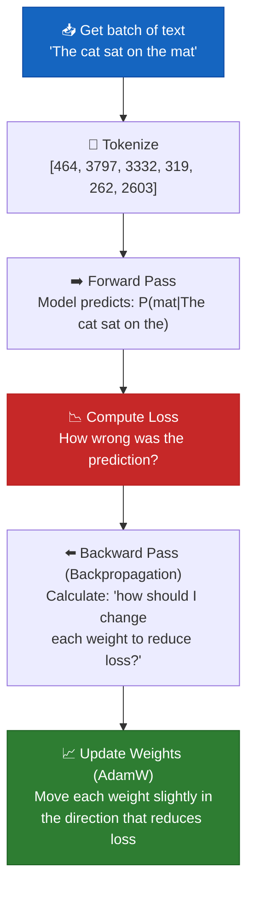

# Chapter 8 — The Training Pipeline

## What Is "Training" — Really?

Training a language model is like teaching a child to read:

1. Show them a sentence: "The cat sat on the ___"
2. Ask them to guess the missing word
3. If they guess right → good job, no change needed
4. If they guess wrong → correct them, they adjust their understanding slightly
5. Repeat millions of times with millions of sentences

Mathematically, this is **gradient descent**: the model makes a prediction, measures how wrong it was (loss), then adjusts its 124 million parameters slightly to be less wrong next time.

## The Training Loop — Visual



## Cross-Entropy Loss — The Math

### What Loss Actually Measures

Given the model's prediction for the next word:

```
True next word: "mat" (token ID 2603)

Model's predicted probabilities:
  "mat":   0.45  ← model thinks 45% chance of "mat"
  "rug":   0.30  ← 30% chance of "rug"
  "floor": 0.15  ← 15% chance
  "table": 0.07  ← 7% chance
  "dog":   0.03  ← 3% chance of something random
```

**Cross-entropy loss** for this prediction:
```
loss = -log(P("mat")) = -log(0.45) = 0.799
```

If the model was more confident:
```
P("mat") = 0.95  →  loss = -log(0.95) = 0.051  ← much better!
```

If the model was wrong and confident:
```
P("mat") = 0.01  →  loss = -log(0.01) = 4.605  ← terrible!
```

### The Full Cross-Entropy Formula

For a single prediction with true class `y` and predicted probabilities `p`:
```
Loss = -log(p_y)
```

For a batch of `N` predictions:
```
Loss = -(1/N) Σ log(p_y_true)
```

This is exactly what `F.cross_entropy(logits, targets)` computes. It:
1. Applies softmax to convert logits → probabilities
2. Takes negative log of the probability for the correct class
3. Averages across all tokens in the batch

### Why -log? Why not just error rate?

| Approach | Formula | Gradient Signal |
|---|---|---|
| Error rate | 1 if wrong, 0 if right | Zero gradient — can't optimize |
| -log(p) | -log(0.45) = 0.80 | Smooth gradient — easy to optimize |
| -(1-p) | -(1-0.45) = -0.55 | Weaker signal for confident wrong answers |

`-log(p)` has a special property: the gradient gets STRONGER as we get more wrong. If `p=0.01`, the gradient is 100x larger than if `p=0.99`. This means the model learns fastest from its biggest mistakes.

## Backpropagation — In Plain English

"The model is a big math function with 124 million knobs. We want to find which direction to turn each knob to make the loss smaller."

### The Chain Rule Analogy

Imagine you're baking and the cake comes out too sweet. You need to reduce sugar. But you don't know how much reducing sugar by 1 gram affects sweetness. And you don't know how much reducing sweetness by 1 unit affects the "cake quality score."

```
∂(quality)     ∂(quality)     ∂(sweetness)
──────────  =  ──────────  ×  ───────────
  ∂(sugar)      ∂(sweetness)    ∂(sugar)
  
  "How much        "How much      "How much
   does sugar       sweetness      does sugar
   affect           affects        affect
   quality?"        quality?"      sweetness?"
```

Backpropagation applies this chain rule **backwards through the entire model** — from the loss, through each layer, back to the embeddings — computing how much each parameter contributed to the error.

### Without Calculus: An Intuitive View

```python
# Imagine this is in the training loop:
loss = F.cross_entropy(predictions, targets)  # "How wrong were we?"
loss.backward()                                 # "Figure out WHY we were wrong"

# After backward(), every parameter now has a .grad attribute:
print(model.token_embedding.weight.grad[9246, 42])
# → 0.000342  "If we increase embedding cat[42] by 0.001,
#              the loss decreases by 0.000342"
```

## Gradient Descent with AdamW

### Simple Gradient Descent

```
weight = weight - learning_rate × gradient
```

This is like: "If the gradient says 'go left', take a small step left."

### AdamW — Three Improvements

1. **Momentum (β₁ = 0.9):** Remember the DIRECTION. Like a ball rolling down a hill — it builds speed. This smooths out noisy gradients.

2. **Adaptive Learning Rate (β₂ = 0.95):** Each parameter gets its own learning rate based on how much it's been moving. Parameters that rarely change get bigger steps. Parameters bouncing back and forth get smaller steps.

3. **Decoupled Weight Decay:** Directly shrink weights toward zero (preventing them from growing too large). Unlike vanilla Adam, this is separated from the gradient scaling.

```
AdamW update step:
  momentum       = β₁ × old_momentum + (1-β₁) × gradient
  velocity       = β₂ × old_velocity + (1-β₂) × gradient²
  corrected_m    = momentum / (1 - β₁^t)     (bias correction)
  corrected_v    = velocity / (1 - β₂^t)     (bias correction)
  weight         = weight (1 - lr × weight_decay)  (decoupled!)
  weight         = weight - lr × corrected_m / (√corrected_v + ε)
```

## Mixed Precision Training

### Float32 vs BFloat16 vs Float16

| Format | Bits | Exponent | Mantissa | Range | Precision |
|---|---|---|---|---|---|
| Float32 | 32 | 8 | 23 | ±3.4 × 10³⁸ | 7 decimal digits |
| Float16 | 16 | 5 | 10 | ±65,504 | 3 decimal digits |
| **BFloat16** | 16 | 8 | 7 | ±3.4 × 10³⁸ | 2 decimal digits |

**Why BFloat16:** Same range as float32 (no overflow!), but half the memory and 2x faster matrix multiplications. Less precision than float16, but neural networks don't need high precision — they're robust to rounding.

**Our approach:** Forward pass in bfloat16 (fast), keep master weights in float32 (accurate updates).

```python
# autocast context: automatically uses bfloat16 where safe
with torch.cuda.amp.autocast(enabled=use_amp):
    _, loss = model(input_ids, targets=target_ids)

# scaler handles loss scaling for float16, not needed for bfloat16 on modern GPUs
# but included for compatibility
scaler.scale(loss).backward()
scaler.step(optimizer)
```

## Gradient Accumulation

**Problem:** You want effective batch size 32 but GPU only fits batch size 4.

**Solution:** Run 4 forward passes with batch=4, accumulate gradients (sum them), then do ONE optimizer step. This is mathematically equivalent to batch=32.

```python
# Instead of:
for batch_32 in data:  # Doesn't fit in GPU memory!
    loss = model(batch_32)
    loss.backward()
    optimizer.step()

# We do:
for i in range(4):
    loss = model(batch_4)           # batch_4 fits in memory
    (loss / 4).backward()           # Scale: each batch contributes 1/4
                                    # Gradient ACCUMULATES in .grad attributes
optimizer.step()                    # One update for all 4 mini-batches
optimizer.zero_grad()              # Reset for next accumulation cycle
```

## Overfitting — The Model "Memorizes"

**What it looks like:** Training loss keeps decreasing, but generated text gets worse — repetitive, nonsensical, or copying training data verbatim.

**Why it happens:** The model memorizes the training data instead of learning general language patterns.

**How we prevent it:**
| Technique | How It Helps |
|---|---|
| **Dropout (0.1)** | Randomly disables 10% of neurons during training — forces redundancy |
| **Weight decay (0.1)** | Keeps weights small — large weights → memorization |
| **Large, diverse dataset** | More data → harder to memorize everything |
| **Early stopping** | Stop training when validation loss stops improving |
| **Gradient clipping** | Prevents a few examples from dominating weight updates |

## Complete Training Code

### Dataset

```python
import torch
from torch.utils.data import Dataset


class TextDataset(Dataset):
    """
    WHAT: Prepares text data by splitting into training chunks.
    WHY: The model learns to predict the next token. Each chunk
         provides input-target pairs for next-token prediction.

         Each sample: input[t] and target[t+1] for all positions t.
         This is called "teacher forcing" — we show the correct
         answer for every position during training.
    """

    def __init__(self, texts: list[str], tokenizer, max_seq_len: int = 1024):
        self.tokenizer = tokenizer
        self.max_seq_len = max_seq_len

        # ===== Concatenate all texts with EOS separators =====
        # WHY: EOS prevents the model from learning false connections
        #      between unrelated documents.
        all_tokens = []
        for text in texts:
            tokens = tokenizer.encode(text)
            all_tokens.extend(tokens)
            all_tokens.append(tokenizer.eos_token_id)  # Document boundary marker

        self.tokens = torch.tensor(all_tokens, dtype=torch.long)
        print(f"Total tokens in dataset: {len(self.tokens):,}")

    def __len__(self) -> int:
        """Number of chunks. Each uses max_seq_len+1 tokens."""
        return (len(self.tokens) - 1) // self.max_seq_len

    def __getitem__(self, idx: int) -> tuple:
        """
        Returns (input_ids, target_ids) for one chunk.
        Target is shifted by 1 position:

        tokens:    [The,  cat,  sat,  on,   the,  mat,  EOS,  The,  dog,  ...]
        idx=0:     [The,  cat,  sat,  on,   the]     ← input_ids
                   [cat,  sat,  on,   the,  mat]     ← target_ids (shifted)
        """
        start = idx * self.max_seq_len
        end = start + self.max_seq_len
        input_ids = self.tokens[start:end]
        target_ids = self.tokens[start + 1 : end + 1]
        return input_ids, target_ids
```

### Data Loading

```python
from datasets import load_dataset


def load_training_data(max_samples: int = None):
    """Download WikiText-103 — clean Wikipedia text."""
    print("Loading dataset: wikitext-103-raw-v1...")
    dataset = load_dataset("wikitext", "wikitext-103-raw-v1", split="train")
    texts = [item["text"] for item in dataset if item["text"].strip()]
    if max_samples:
        texts = texts[:max_samples]
    print(f"Loaded {len(texts):,} documents")
    return texts
```

### LR Scheduler

```python
import math


class CosineWarmupScheduler:
    """
    WHAT: Three-phase learning rate schedule.
    WHY: Warmup prevents early instability. Cosine decay provides
         smooth convergence. Minimum floor prevents zero learning.

    Phase 1 (Warmup):    LR: 0 → max_lr  (linear increase over warmup_steps)
    Phase 2 (Decay):     LR: max_lr → min_lr (cosine curve)
    Phase 3 (Minimum):   LR: min_lr (constant)
    """
    def __init__(self, optimizer, warmup_steps, max_steps, max_lr=3e-4, min_lr=1e-5):
        self.optimizer = optimizer
        self.warmup_steps = warmup_steps
        self.max_steps = max_steps
        self.max_lr = max_lr
        self.min_lr = min_lr
        self.current_step = 0

    def get_lr(self) -> float:
        step = self.current_step
        if step < self.warmup_steps:
            return self.max_lr * step / self.warmup_steps
        if step < self.max_steps:
            progress = (step - self.warmup_steps) / (self.max_steps - self.warmup_steps)
            cosine_decay = 0.5 * (1.0 + math.cos(math.pi * progress))
            return self.min_lr + (self.max_lr - self.min_lr) * cosine_decay
        return self.min_lr

    def step(self):
        lr = self.get_lr()
        for param_group in self.optimizer.param_groups:
            param_group["lr"] = lr
        self.current_step += 1

    def state_dict(self):
        return {"current_step": self.current_step}

    def load_state_dict(self, state_dict):
        self.current_step = state_dict["current_step"]
```

### Optimizer

```python
def create_optimizer(model, config):
    """
    WHAT: AdamW with two parameter groups (with/without weight decay).
    WHY: Norm layers and biases should NOT get weight decay — it
         pushes them toward zero, destroying normalization.

    Group 1 (weight_decay > 0): Linear weights, embeddings
    Group 2 (weight_decay = 0): Biases, RMSNorm, LayerNorm
    """
    decay_params = []
    no_decay_params = []

    for name, param in model.named_parameters():
        if not param.requires_grad:
            continue
        if param.dim() <= 1 or "norm" in name.lower() or "bias" in name:
            no_decay_params.append(param)
        else:
            decay_params.append(param)

    return torch.optim.AdamW(
        [
            {"params": decay_params, "weight_decay": config.weight_decay},
            {"params": no_decay_params, "weight_decay": 0.0},
        ],
        lr=config.learning_rate,
        betas=config.betas,
        eps=config.eps,
    )
```

### The Training Loop

```python
import torch
import time
import os


def train(model, train_dataset, config, device, save_dir="checkpoints"):
    """
    WHAT: The main training loop.
    WHY: Iterates: forward → backward → update, logging and saving periodically.
    """
    os.makedirs(save_dir, exist_ok=True)
    model = model.to(device)
    model.train()

    dataloader = torch.utils.data.DataLoader(
        train_dataset, batch_size=config.batch_size,
        shuffle=True, drop_last=True, num_workers=4, pin_memory=True,
    )

    optimizer = create_optimizer(model, config)
    scheduler = CosineWarmupScheduler(
        optimizer, warmup_steps=config.warmup_steps,
        max_steps=config.max_steps, max_lr=config.learning_rate,
    )

    use_amp = device.type == "cuda"
    scaler = torch.cuda.amp.GradScaler(enabled=use_amp) if use_amp else None

    step = 0
    total_loss = 0.0
    loss_history = []
    best_loss = float("inf")
    start_time = time.time()

    print(f"\n{'='*60}")
    print(f"Training! Params: {model.get_num_params():,} | Device: {device}")
    print(f"Effective batch: {config.batch_size * config.grad_accum_steps}")
    print(f"{'='*60}\n")

    while step < config.max_steps:
        for batch_idx, (input_ids, target_ids) in enumerate(dataloader):
            if step >= config.max_steps:
                break

            input_ids = input_ids.to(device, non_blocking=True)
            target_ids = target_ids.to(device, non_blocking=True)

            # ===== FORWARD: Predict next tokens, measure error =====
            with torch.cuda.amp.autocast(enabled=use_amp):
                _, loss = model(input_ids, targets=target_ids)
            loss = loss / config.grad_accum_steps

            # ===== BACKWARD: Calculate how to improve =====
            if use_amp and scaler is not None:
                scaler.scale(loss).backward()
            else:
                loss.backward()

            total_loss += loss.item() * config.grad_accum_steps

            # ===== UPDATE: Every grad_accum_steps, optimize =====
            if (batch_idx + 1) % config.grad_accum_steps == 0:
                if use_amp and scaler is not None:
                    scaler.unscale_(optimizer)
                torch.nn.utils.clip_grad_norm_(model.parameters(), max_norm=1.0)

                if use_amp and scaler is not None:
                    scaler.step(optimizer); scaler.update()
                else:
                    optimizer.step()

                optimizer.zero_grad()
                scheduler.step()
                step += 1

                # Logging every 100 steps
                if step % 100 == 0 or step == 1:
                    avg_loss = total_loss / (100 if step > 0 else 1)
                    elapsed = time.time() - start_time
                    tps = (step * config.batch_size * config.grad_accum_steps
                           * config.max_seq_len) / elapsed
                    print(f"Step {step:>6,}/{config.max_steps:,} | "
                          f"Loss: {avg_loss:.4f} | LR: {scheduler.get_lr():.2e} | "
                          f"Toks/sec: {tps:,.0f}")
                    loss_history.append((step, avg_loss))
                    total_loss = 0.0

                # Save checkpoint every 5000 steps
                if step % 5000 == 0:
                    checkpoint = {
                        "step": step, "model_state_dict": model.state_dict(),
                        "optimizer_state_dict": optimizer.state_dict(),
                        "scheduler_state_dict": scheduler.state_dict(),
                        "loss": avg_loss, "config": config,
                    }
                    torch.save(checkpoint, f"{save_dir}/checkpoint_step_{step}.pt")
                    print(f"   Saved checkpoint at step {step}")
                    if avg_loss < best_loss:
                        best_loss = avg_loss
                        torch.save(checkpoint, f"{save_dir}/best_model.pt")

    total_time = time.time() - start_time
    print(f"\n{'='*60}")
    print(f"Done! {total_time/60:.1f} min | Best loss: {best_loss:.4f}")
    print(f"{'='*60}\n")
    return loss_history


def plot_loss(loss_history, save_path="loss_curve.png"):
    """
    WHAT: Visualize training progress.
    WHY: Loss curves diagnose problems:
         ↘ Steady decrease: training is working
         → Flat line: stalled (higher LR, check data)
         ↗ Increasing: overfitting (more dropout, weight decay)
         ⚡ Spikes: unstable (lower LR, longer warmup)
    """
    import matplotlib.pyplot as plt
    steps, losses = zip(*loss_history)
    plt.figure(figsize=(10, 5))
    plt.plot(steps, losses)
    plt.xlabel("Training Step"); plt.ylabel("Loss")
    plt.title("GPT Training Loss")
    plt.grid(True, alpha=0.3)
    plt.tight_layout(); plt.savefig(save_path, dpi=150); plt.close()
    print(f"Loss curve saved to {save_path}")
```

---

**Previous:** [Chapter 7 — GPT Model](07_gpt_model.md)
**Next:** [Chapter 9 — Inference](09_inference.md)
