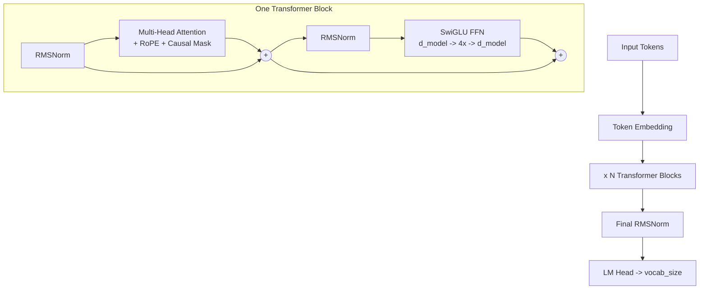

# Chapter 11 — Glossary of Modern Techniques

## Complete Architecture Diagram



## Techniques Summary

| Technique | Old Way | Modern Way | Why Better |
|---|---|---|---|
| **Position Encoding** | Learned (GPT-2) or Sinusoidal | **RoPE** (LLaMA, Mistral) | Relative positions, any length |
| **Normalization** | LayerNorm | **RMSNorm** (LLaMA) | ~15% faster, equally effective |
| **Activation** | ReLU or GELU | **SwiGLU** (PaLM, LLaMA) | Better at scale |
| **Norm Position** | Post-Norm (after sublayer) | **Pre-Norm** (GPT-3, LLaMA) | Much more stable training |
| **Optimizer** | SGD or Adam | **AdamW** (decoupled decay) | Better generalization |
| **LR Schedule** | Constant or step | **Cosine with warmup** | Smoother convergence |
| **Precision** | Float32 | **bfloat16 mixed** | 2x faster, half memory |
| **Gradient Clipping** | None or ad-hoc | **Max norm 1.0** | Prevents explosion |
| **Weight Init** | Xavier uniform | **Normal(0, 0.02)** | GPT-family standard |
| **Weight Tying** | Separate embed & output | **Shared weights** | Fewer params, more signal |
| **Training Objective** | Masked LM (BERT) | **Next-token prediction** | Enables text generation |

## Parameter Count Breakdown

For our 151M model (LLaMA-style with SwiGLU):

```
Token Embedding:  vocab_size x d_model = 50,257 x 768 = 38,597,376

Per Transformer Block (12 total):
  Attention QKV:   3 x 768 x 768 = 1,769,472
  Attention Out:   768 x 768     =   589,824
  SwiGLU w1:       768 x 3072    = 2,359,296
  SwiGLU w2:       768 x 3072    = 2,359,296
  SwiGLU w3:       3072 x 768    = 2,359,296
  RMSNorm x2:      768 + 768     =     1,536
  Total/block:                  = 9,438,720

12 blocks:  12 x 9,438,720     = 113,264,640

Final RMSNorm:                 =       768
LM Head: shared with embedding =         0 (weight tying!)

Grand Total: 38,597,376 + 113,264,640 + 768 = 151,862,784 parameters

For comparison: a standard GPT-2 (without SwiGLU, using GELU FFN)
would have ~124M parameters. SwiGLU adds about 28M extra parameters
by replacing 2 FFN weight matrices with 3 gated ones.
```

## What You've Built

By following this tutorial, you've built a **LLaMA-style decoder-only Transformer** using the best publicly-documented techniques:

- A **BPE tokenizer** (same algorithm as GPT-2/3/4)
- A **Transformer** with modern improvements:
  - Multi-Head Attention + **RoPE** position encoding (LLaMA, Mistral, Qwen)
  - **RMSNorm** normalization (LLaMA, Mistral, Gemma)
  - **SwiGLU** activation (PaLM, LLaMA, Gemini)
  - **Pre-Norm** residual connections (GPT-3, all modern models)
  - **Weight tying** between embedding and output (GPT-2/3)
  - **Causal masking** for autoregressive training (all GPT-family models)
- A **complete training pipeline**:
  - AdamW + decoupled weight decay
  - Cosine LR schedule with warmup
  - Gradient accumulation
  - Mixed precision (bfloat16)
  - Gradient clipping
  - Checkpointing
- An **inference engine** with:
  - Temperature scaling
  - Top-K and Top-P sampling

## Next Steps

| Experiment | What to Change | What You'll Learn |
|---|---|---|
| Bigger model | Increase layers, d_model | How scale improves quality |
| More data | Full WikiText + BookCorpus | Impact of data quality |
| Flash Attention | Replace with flash_attn | 2-5x faster, longer context |
| Grouped Query Attention | Reduce KV heads | Efficient inference |
| LoRA fine-tuning | Add low-rank adapters | Fine-tune without full training |
| KV Cache | Cache key-value pairs | 100x faster generation |
| Mixture of Experts | Route tokens through experts | How GPT-4 scales |

## Architecture Provenance Table

| Technique | GPT-2 (2019) | GPT-3 (2020) | LLaMA (2023) | LLaMA 3 / Mistral / Qwen 2.5 (2024-25) | GPT-4 / Claude |
|---|---|---|---|---|---|
| Decoder-only | Yes | Yes | Yes | Yes | Likely |
| Learned Position | Yes | Yes | No | No | Unknown |
| **RoPE** | No | No | Yes | Yes | Unknown |
| LayerNorm | Yes | Yes | No | No | Unknown |
| **RMSNorm** | No | No | Yes | Yes | Unknown |
| GELU | Yes | Yes | No | No | Unknown |
| **SwiGLU** | No | No | Yes | Yes | Unknown |
| Pre-Norm | No | Yes | Yes | Yes | Likely |
| Weight Tying | Yes | Likely | Yes | Yes | Unknown |
| AdamW | No | Yes | Yes | Yes | Likely |

> **Bottom line:** This guide teaches the **LLaMA 3 / Mistral / Qwen 2.5 architecture** — the state of the art that is **publicly documented**. GPT-4 and Claude may use similar or different techniques; we simply don't know. But every model listed above is built on the same Transformer foundation, so by learning this architecture, you understand the core principles behind ALL modern LLMs.

---

**Previous:** [Chapter 10 — Full Script](10_full_script.md)
**Start over:** [Chapter 0 — Overview](00_overview.md)
